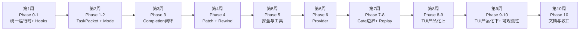
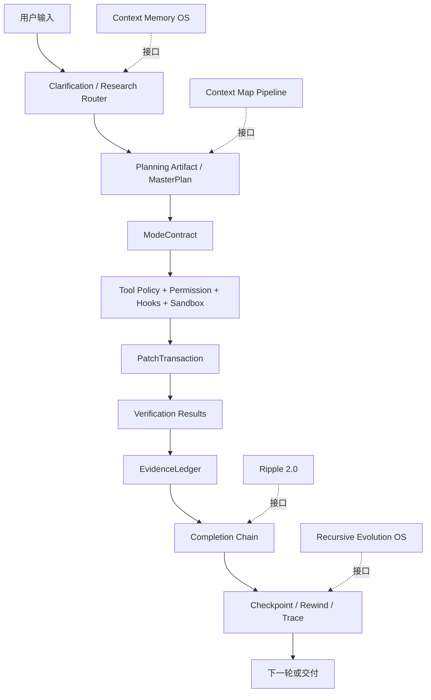

# Orcana v1.0 完整路线图

> **基线版本**: v0.3.0  
> **目标版本**: v1.0  
> **创建日期**: 2026-06-27  
> **依据**: [Deep Research 绝对性审查报告](D:\LFQ\文档文件\deep-research-report.md) × Strong Single v1.0 实行计划  
> **规模**: 10 Phase / 32+ PR / 8-10 周  
> **核心原则**: 先修 hooks 和状态机，再固化 TaskPacket；先统一 completion 和 evidence，再升级 patch/rewind；先有 replay，再继续扩展。

---

## 版本路线

```
v0.3.0 — 当前基线（Phase 0-6 完成，265+ tests, tsc 0 errors）
v0.9   — runtime closure（Phase 7-8 完成后）
v1.0   — strong single stable（全 10 Phase 完成后）
v1.5   — memory/context/evolution expansion
v2.0   — T3R multi-agent
```

---

## 1. 执行摘要

基于对 `main` 分支 README、ARCHITECTURE、`src/**`、`tests/**` 与关键官方资料的交叉审查，DeepSeek Orcana 已具备"强约束、强门控、单智能体工程循环"的鲜明风格，尤其在入口分诊、完成门控、运行时约束、DeepSeek 特性利用和中文工程化表达上，明显优于普通"会读会改会跑"的壳式 coding agent。

当前问题不在"有没有高级概念"，而在**闭环是否真正落地**：若要达到可比 Claude Code 的能力，必须先把 hooks/gates 边界、TaskPacket→MasterPlan→PatchTransaction→EvidenceLedger→Completion 的单路径收束、共享运行时装配、checkpoint/rewind UX、TUI/CLI 一致性、测试与文档真实性做实。

**结论**: 方向正确，架构密度很高，但仍未到"可稳定比肩 Claude Code"阶段；完成本文 P0 后，可进入同级竞品的工程可用区间，同时保留 Orcana 的约束优先风格。

### 当前能力定位

- **能力定位**: 中高复杂度本地 coding agent，偏 TS/Bun/DeepSeek 栈，适合做"约束优先"的研发试验场
- **与 Claude Code 的距离**: 架构理念接近，但产品闭环和统一性不足。Claude Code 的 hooks 生命周期、memory/skills 装载策略、rewind/checkpoint UX 更成熟
- **10 周内达成目标**: 有可能。前提是聚焦 P0：统一 runtime、收束 gate/transaction/evidence 闭环、把 checkpoint/rewind 与 TUI/CLI 做成真正可用的用户能力、修正文档与实现不一致

---

## 2. 总体结论与分类清单

### 2.1 必须保留（Orcana 差异化核心）

以下属于 Orcana 的差异化核心，不应被"Claude-like 化"过程中抹平：

| # | 能力 | 说明 |
|---|------|------|
| 1 | **约束优先单智能体主循环** | `loop.ts` 仍是系统的总调度中心，显式整合了 Flash Triage、MasterPlan、Plan Validator、Permission、Sandbox、Checkpoint、ContextEpoch、ModeContract、EvidenceLedger 等能力 |
| 2 | **Flash Triage / Flash Judge** | 入口分诊和独立完成度评估，明确使用 `deepseek-v4-flash` 作为子判定器 |
| 3 | **DeepSeek 特性深度适配** | thinking mode、tool-call 下 reasoning_content 续传、1M context、context caching、FIM beta |
| 4 | **状态机 + 门控溢出 + 运行时自编辑防呆** | 限制 agent 犯蠢的设计，是 Orcana 的品牌能力 |
| 5 | **Run Trace / Gate Telemetry / 证词账本式审计** | 决定了后续可观测性与 replay 价值 |

### 2.2 必须删除/修正

| # | 问题 | 说明 |
|---|------|------|
| 1 | **重复的 CLI/TUI 装配逻辑** | 改为单一 `runtime/bootstrap`。当前 `src/ui/cli.ts` 和 `src/tui/main.tsx` 各自装配 provider、tools、agent loop，必然导致漂移 |
| 2 | **过时注释和未来态谎言** | `master-plan.ts` 顶部写"implemented, not yet wired into loop.ts"，但 `loop.ts` 已在导入并调用 MasterPlan |
| 3 | **README/ARCH 超前宣传** | 降级为"已实现/部分接线/实验性"三级标注。当前 README 将能力包装为统一成熟闭环，但若干模块仍处于 phase 1 或 future state |
| 4 | **版本号漂移** | ✅ 已在 v0.2.2 修复。CLI 0.3.0、TUI 0.4.0、index.ts 0.2.1 → 统一为 0.2.2 |

### 2.3 可选保留

| # | 项目 | 条件 |
|---|------|------|
| 1 | **keyword-based `createTaskTracker` fallback** | TaskPacket/PlanValidator/MasterPlan 完整闭环稳定前保留；闭环稳定后降级到兼容层 |
| 2 | **Chat-lite / 多命令别名 / 部分兼容层** | 继续保留，归档到"体验层"，不侵入核心运行时设计 |
| 3 | **SQLite + JSON fallback session 兼容** | 短期保留合理，长期应收敛为单一存储实现 |

### 2.4 需重构模块清单

```
src/hooks/**              — 生命周期事件模型
src/agent/master-plan.ts  — 注释与实现一致性 + 节点→模式→事务→证据闭环
src/agent/task-tracker.ts — 退化为执行进度镜像层
src/agent/patch-transaction.ts — Phase 2 原子替换
src/agent/evidence-ledger.ts   — 单一 done 路径
src/agent/mode-contract.ts     — 自动流转
src/provider/router.ts         — purpose routing
src/ui/cli.ts 与 src/tui/main.tsx — 共享 runtime
src/mcp/bridge.ts              — resources/prompts 适配
tests/**                       — 闭环覆盖组织
README / ARCHITECTURE / CONTRIBUTING — 状态标注体系
```

---

## 3. 模块逐项审查表

> 下表按"源码文件或模块"给出建议。覆盖对最终能力最关键、最容易形成技术债或产品感知差异的模块。

| 模块 / 文件 | 当前状态 | 建议动作 | 理由 | 风险 | 回退方案 | 优先级 | 估算人日 | 验收标准 |
|---|---|---|---|---|---|---|---|---|
| `src/agent/loop.ts` | 核心主循环已集成大量 gate/memory/sandbox/provider 逻辑 | **需重构** | 能力强但过载；应继续做 orchestrator，而非容纳更多业务细节 | 拆分过度会损失可追踪性 | 保留单文件总控，只把纯函数/组件化 gate 外提 | P0 | 4 | 逻辑分层图与代码一致；主循环 LOC 降低；行为不回归 |
| `src/ui/cli.ts` | 负责 provider、tools、hooks、session、MCP、run loop 装配 | **需重构** | 与 TUI 重复装配，版本漂移已修复 | CLI/TUI 行为继续漂移 | 先抽 `createRuntime()`，CLI/TUI 只做前端适配 | P0 | 3 | CLI/TUI 使用同一 runtime bootstrap；版本统一 |
| `src/tui/main.tsx` + `src/tui/input.tsx` | 已有 scroll、paste token 化、clarification wizard、queueCount 指示 | **需重构** | 还缺 plan approval、rewind、evidence report、gate dashboard 等可见能力 | 加 UI 会扰动现有输入逻辑 | 先做只读 Drawer/Modal，不改输入内核 | P1 | 4 | 可审批 plan、查看 evidence、查看 checkpoints/gates |
| `src/hooks/index.ts` | 当前 HookSystem 仅 `onToolBefore/onToolAfter` | **需重构** | 与 Claude Code 的 session/turn/tool 多事件生命周期差距明显 | 插件接口变更影响 builtin hooks | 增量兼容：保留旧 API，新增 typed events | P0 | 2 | 支持 SessionStart/UserPromptSubmit/PreToolUse/PostToolUse 最小集 |
| `src/hooks/builtin.ts` + `safety-policy.ts` | 已有 writeGuard、journal veto、安全策略 | **必须保留 + 需重构** | 从"内置规则集合"升级为可审计 hook manifest | 误拦截影响可用性 | 默认仅 warn，strict 模式 block | P0 | 2 | Hook 决策可追踪、可配置、可按项目覆盖 |
| `src/agent/tool-execution/policy.ts` | 集成 permission、mode、planning 等工具策略 | **需重构** | 这是 deterministic gate 的正确位置，应明确比 semantic gates 更靠前 | 策略冲突导致工具阻塞异常 | 引入 `policy trace` 和优先级 | P0 | 2 | 每次阻塞都能输出 category、来源、优先级 |
| `src/agent/master-plan.ts` | 功能很多，文件头说明"未接线"与 `loop.ts` 现状冲突 | **需重构** | 文档与实现漂移；计划树已存在，但节点→模式→事务→证据的闭环还不够硬 | 计划链路继续半接线 | 先修注释和状态，再做闭环 | P0 | 2 | 注释真实；每个节点能驱动 mode/patch/evidence |
| `src/agent/task-packet.ts` | 已定义 TaskPacket 为结构化任务包 | **必须保留** | 去 keyword heuristics、走结构化执行的正确方向 | 如果不继续推进，会成为另一套"摆设抽象" | 与旧 tracker 双轨一段时间 | P0 | 1 | 所有长任务主路径用 TaskPacket 驱动 |
| `src/agent/task-tracker.ts` | 仍保留 keyword-based tracker fallback | **需重构** | 应退化为"执行进度镜像层" | 老测试会受影响 | 保留 fallback，但只用于 narrow compatibility | P1 | 2 | `createTaskTracker` 不再是长任务主入口 |
| `src/agent/plan-validator.ts` | 零 LLM 结构校验，检查 cycle/uniqueness/tracker 等 | **必须保留** | 强工程味的正确能力，应继续扩展为"运行前契约校验" | 规则过严会误拒计划 | warn/error 双级维持 | P0 | 1 | 计划错误能在不调用模型时直接阻断 |
| `src/agent/planning-gate.ts` | 规则完整、测试质量不错 | **必须保留** | Orcana 区别于普通 agent 的关键 | 过强约束让小任务变慢 | 仅 long_task 启用 | P0 | 1 | 复杂任务 plan 必须可解释、有对比、有验证 |
| `src/agent/evidence-ledger.ts` + `completion-gate` | EvidenceLedger 强调 `canClaimDone()` 单一硬门；completion chain 仍把部分 gate inline 在 loop | **需重构** | 必须把"能否 Done"真正收束到 EvidenceLedger + CompletionChain，而不是多处分散 | 改错会导致错误放行/误阻断 | 先做兼容适配层，再删旧口子 | P0 | 3 | 所有 done 决策只经过一条 evidence path |
| `src/agent/patch-transaction.ts` | 已有 baseHash、forbidden check、rollback snapshot；Phase 1，Phase 2 原子替换未来做 | **需重构** | Claude Code checkpoint/rewind 可比性的基础，但目前缺"temp→verify→swap"与 UI 级 rewind | 写入路径升级易引发回滚 bug | 先在单文件写工具上试点 | P0 | 3 | 写入前后 hash 校验、失败自动回滚、可见 tx id |
| `src/agent/context-epoch.ts` | 四层上下文分层良好，明确 tool chain guard | **必须保留** | 大上下文工程化的正确方向 | 与未来 Context Memory OS 接口重叠 | 只保留 epoch orchestration，记忆策略外接 | P1 | 2 | rollover 不破坏 tool chain；plan state 永不丢 |
| `src/agent/mode-contract.ts` | 五种模式定义清晰，但 `shouldTransitionMode` 还是 stub | **需重构** | "单 agent 内部分工纪律"的关键，不应停留在静态配置 | 模式误切换会阻塞执行 | 先做 node 标签→mode 映射表 | P0 | 2 | 节点切换时 mode 自动切换并生效 |
| `src/provider/router.ts` + `provider/types.ts` | 已有 ProviderCapabilities/ThinkingCapability，per-purpose routing 默认关闭 | **需重构** | 为了 cache continuity 做了正确权衡，但无法发挥 cheap subcall 路由价值 | 频繁换模型会伤 cache hit | 只对明确低成本子调用开启 purpose 路由 | P1 | 2 | `flash_triage/completion_judge` 可独立选 cheap model，主循环不漂移 |
| `src/provider/fim.ts` | 已实现 FIM editor，走 DeepSeek beta completions | **必须保留** | Orcana 的差异化编辑器能力 | FIM 若缺 transaction/evidence 约束很危险 | 仅在 PatchTransaction 保护下启用 | P1 | 1 | FIM 编辑纳入 tx id、scope、verification |
| `src/sandbox/sandbox.ts` + `path-guard.ts` | Windows Job Object 强、macOS/Linux 降级 | **必须保留 + 需重构** | 诚实很重要，但要把"降级能力"做成显式能力矩阵 | 用户误判安全级别 | 启动时打印 OS capability banner | P0 | 2 | Windows/macOS/Linux 各自能力可见、测试齐全 |
| `src/mcp/bridge.ts` + `mcp/config.ts` | 启动时拉起 MCP 子进程，工具默认只读 | **需重构** | 与 MCP 规范的 tools/resources/prompts 三类能力不对齐 | 放开过快会引入 RCE/供应链风险 | 先只增加 resources/prompts 映射，不开放写工具 | P1 | 3 | 支持 MCP resources/prompts 注入；工具有签名/allowlist |
| `src/skills/registry.ts` | 已支持 builtin 和 `~/.claude/skills/` 兼容，trigger-based prompt append | **需重构** | 需要补 skill lifecycle、评价、沉淀、显式调用 | 技能触发过多污染 prompt | 加激活证据与命中统计 | P1 | 2 | 每个 skill 有命中、效果、失效率统计 |
| `src/memory/knowledge.ts` | 已有知识库存储、TTL、SQLite、CJK tokenization | **可选保留** | Context Memory OS 的底座合理 | 与未来记忆方案重复 | 保留存储底座，策略外置 | P2 | 1 | 只作为存储/检索接口，不再侵入 loop 策略 |
| `src/session/checkpoint.ts` + `session/index.ts` | SHA 校验、SQLite session、checkpoint summary 已有基础 | **需重构** | 离 Claude Code 的 rewind UX 还差一层产品闭环 | 引入 rewind UI 可能复杂 | CLI 先做 `/rewind`，TUI 后跟进 | P0 | 3 | 用户可按 checkpoint 恢复代码/对话/摘要 |
| `src/agent/run-trace.ts` | JSONL trace、有限深度 sanitize、secret-like key redaction | **必须保留** | observability 的种子 | 只 redaction key，不 redaction payload 内容 | 保留现状并增加统一 redactor | P1 | 1 | trace/evidence/checkpoint 共用 redactor |
| `tests/**` | 测试面很宽，但 hooks/patch/mode/rewind 闭环测试仍薄 | **需重构** | 从"文件很多"升级到"关键闭环全覆盖" | 改测试结构耗时 | 先加 golden replay + destructive path tests | P0 | 3 | P0 路径都有 unit+integration+replay |
| README / ARCHITECTURE / CONTRIBUTING / SECURITY | 文档丰富，但 README 宣传强度高于真实接线状态 | **需重构** | 文档要成为可信契约，不能成为营销超集 | 可能削弱观感 | 用"稳定/实验/预留"三级标签表达 | P0 | 2 | 文档状态与源码接线一致，版本一致 |

---

## 4. 10 Phase 路线图

### Phase 0: 基线冻结 (W1)

**目标**: 统一运行时装配，消除 CLI/TUI 漂移，修复文档与实现不一致

| PR | 名称 | 内容 | 验收标准 |
|----|------|------|---------|
| PR-0.1 | Runtime Bootstrap | 新增 `src/runtime/bootstrap.ts`，统一 provider/tools/hooks/permission/sandbox/session/checkpoint store/run trace 初始化；CLI 与 TUI 只消费 `createRuntime()` | CLI/TUI provider/tools/hooks 数一致；版本统一为 package.json 版本 |
| PR-0.2 | 文档真实性修复 | 修正 `master-plan.ts` 顶部过时注释；统一 README/ARCHITECTURE/package.json/CLI/TUI 版本；对所有实验态模块加 `stable / partial / planned` 标签；SECURITY 补充 macOS/Linux sandbox 降级和 MCP 风险提示 | CI 校验 README 版本与 package 一致；文档生成脚本扫描"not yet wired/future/phase 2"并自动纳入状态表 |

### Phase 1: HookSystem 2.0 P0 修复 (W1-2)

**目标**: hooks 语义重构，writeGuard 正确阻断，CLI/TUI 同源

| PR | 名称 | 内容 | 验收标准 |
|----|------|------|---------|
| PR-1.1 | HookOutput 语义重构 | block > replace > warn > allow 四级输出；hook 决策可追踪到来源 | 每个 hook 输出带 trace source |
| PR-1.2 | writeGuard 拆 before/after | 未读覆盖从 warn→block（严格模式）；before-hook 检查文件是否已被读取 | 未读文件写入被阻断 |
| PR-1.3 | CLI/TUI default hooks 统一 | 移除各自 hooks 装配，统一从 `createRuntime()` 注入 | 同源安全策略 |

### Phase 2: MasterPlan / ModeContract / TaskPacket (W2)

**目标**: TaskPacket 成为长任务唯一主入口，ModeContract 自动流转

| PR | 名称 | 内容 | 验收标准 |
|----|------|------|---------|
| PR-2.1 | TaskPacket JSON/Zod 校验 | TaskPacket 结构化校验 fail closed；非法 TaskPacket 不能进入执行 | 非法 TaskPacket 被 PlanValidator 阻断 |
| PR-2.2 | MasterPlan 节点驱动 ModeContract | `shouldTransitionMode` 从 stub 变为真实实现；node→mode 映射表；节点切换时 mode 自动切换并生效 | review/report 模式下写工具严格阻断 |
| PR-2.3 | TaskPacket 接管长任务主路径 | keyword tracker 退化为兼容层；长任务执行只走 TaskPacket/MasterPlan | `createTaskTracker` 不再是 long_task 主入口 |
| PR-2.4 | PlanValidator 强化 | 零 LLM 结构校验扩展为"运行前契约校验"；warn/error 双级 | 计划错误能在不调用模型时直接阻断 |

### Phase 3: Completion Orchestrator + Evidence (W3)

**目标**: 统一所有 final 前 gate，Evidence 硬绑定，"未验证不能 claim done"

| PR | 名称 | 内容 | 验收标准 |
|----|------|------|---------|
| PR-3.1 | CompletionOrchestrator | 统一所有 final 前 gate（RippleExit / Planning / TaskTracker / Quality / Evidence / FlashJudge）；单一 done 决策路径；删除 loop 内分散 done 判定 | 所有 done 决策只经过一条 evidence path |
| PR-3.2 | EvidenceGate 硬绑定 | `canClaimDone()` 成为唯一 done 判定入口；未完成 evidence 时 done 必阻断 | 无 evidence 不可交付 |
| PR-3.3 | FinalTruthfulnessGate | finalText vs EvidenceLedger 交叉校验；report 可结构化输出 | 声称完成与实际证据不一致时阻断 |

### Phase 4: PatchTransaction + Rewind (W4)

**目标**: patch 冲突不写入，支持 `/rewind`（代码/对话/两者）

| PR | 名称 | 内容 | 验收标准 |
|----|------|------|---------|
| PR-4.1 | PatchTransaction 状态机 | proposed→applied_to_temp→verified→committed→rolled_back 完整状态机 | 写入前后 hash 校验、失败自动回滚、可见 tx id |
| PR-4.2 | PatchTransaction Phase 2 | temp→verify→swap 原子替换；禁止写入 .git/node_modules/.deepseek-code/.codegraph/.wolf + path escape | 原子写入，部分失败全部回滚 |
| PR-4.3 | Unified Rewind — CLI | CLI `/rewind` 命令；三种恢复模式：仅代码/仅对话/代码+对话；每个用户 prompt 都写 checkpoint | rollback 后文件哈希与 checkpoint 一致；conversation-only rewind 不改代码 |
| PR-4.4 | Checkpoint 摘要与 UI 准备 | checkpoint UUID + 人类可读摘要；TUI rewind 接口预留 | checkpoint 列表可查看和选择 |

### Phase 5: 工具风险 / 权限 / 沙箱 (W5)

**目标**: 风险分级、shell 写入记录、secret 不进 prompt、沙箱能力可见

| PR | 名称 | 内容 | 验收标准 |
|----|------|------|---------|
| PR-5.1 | ToolRiskTaxonomy | Risk 0-5 五级分类；Risk 4-5（git mutation、外部效应）需用户确认，禁止 session allow | 每次工具调用有 risk level |
| PR-5.2 | Permission UX | Risk 4/5 确认 UI（CLI + TUI）；policy trace 输出 category、来源、优先级 | 每次阻塞都有 trace |
| PR-5.3 | ShellSideEffectGuard | rm/mv/git reset 等副作用命令追踪；写入 scope 外文件警告 | shell 副作用可审计 |
| PR-5.4 | SecretRedaction 全链路 | run trace + checkpoint + evidence + tool-output 共用 redactor | secret-like 内容不进 prompt/trace/checkpoint |
| PR-5.5 | SandboxCapability 可见化 | 启动时打印 OS capability banner（Windows Job Object / macOS 降级 / Linux 降级）；OS 能力矩阵文档 | Windows/macOS/Linux 各自能力可见、测试齐全 |

### Phase 6: ModelRouter / Provider (W6)

**目标**: 所有模型调用有 purpose，结构化输出 fail closed，FIM 安全约束

| PR | 名称 | 内容 | 验收标准 |
|----|------|------|---------|
| PR-6.1 | ModelRouter purpose routing | `flash_triage/completion_judge` 可独立选 cheap model；主循环保持 session model pinning 以维持 cache 命中 | cheap subcall 不漂移主模型 |
| PR-6.2 | ProviderCapabilities | 非 DeepSeek provider 不走专有特性（thinking tokens、FIM、context caching）；能力矩阵显式声明 | 换 provider 时特性自动降级 |
| PR-6.3 | DeepSeekTranscriptManager | 未闭合 tool chain 不允许 epoch rollover（防止 HTTP 400） | rollover 不破坏 tool chain |
| PR-6.4 | JSON/Zod 统一结构化输出 | 所有模型调用结构化输出 fail closed（非法 JSON → 重试 → fallback） | 结构化输出失败时有明确降级路径 |
| PR-6.5 | FIM 安全约束 | FIM 编辑纳入 tx id、scope、verification；仅在 PatchTransaction 保护下启用 | FIM 编辑有 transaction 保护 |

### Phase 7: Deterministic Gate 边界 + Hooks 生命周期 (W7)

**目标**: deterministic policy 与 semantic gates 分层，hooks 支持完整生命周期事件

| PR | 名称 | 内容 | 验收标准 |
|----|------|------|---------|
| PR-7.1 | Gate 边界重划 | hooks 只管生命周期拦截与上下文注入；policy/permission/mode/sandbox 只管确定性放行/阻断；completion/planning/quality/flash judge 只管语义性 gate；三层的 trace source 不同 | 每个 block 都有单一来源与 telemetry |
| PR-7.2 | Hooks 生命周期事件 | 实现最小事件集：SessionStart、UserPromptSubmit、PreToolUse、PostToolUse、Stop；对齐 Claude Code 生命周期设计方向 | hook 可在 SessionStart 注入上下文；PreToolUse 可阻断 shell 写外部路径 |
| PR-7.3 | Hook manifest 可审计 | builtin hooks 升级为可审计 manifest；可按项目覆盖配置 | Hook 决策可追踪、可配置、可按项目覆盖 |

### Phase 8: E2E Replay + CI (W7-8)

**目标**: Core 50 CI 门禁、mini benchmark

| PR | 名称 | 内容 | 验收标准 |
|----|------|------|---------|
| PR-8.1 | E2E Replay Schema 升级 | 覆盖 P0 闭环（master-plan、context-epoch、false-done、ripple、patch-transaction、mode-contract、rewind） | 7 domain 全部有 replay cases |
| PR-8.2 | Core 50 Replay Set | CI 门禁，每次 PR 必须通过 | CI green = 无回归 |
| PR-8.3 | SWE-style Mini Benchmark | pass@1、false done rate、cost 三项指标 | 基线值记录，每次 PR 不退化 |
| PR-8.4 | Golden Replay + Destructive Path Tests | P0 路径都有 unit+integration+replay 三层覆盖 | 覆盖率 ≥ 80% |

### Phase 9: TUI / CLI 产品化 (W8-9)

**目标**: 长输入不卡、执行中可继续输入、plan approval / evidence / rewind / gate dashboard

| PR | 名称 | 内容 | 验收标准 |
|----|------|------|---------|
| PR-9.1 | TUI 长输入/滚动/执行中追加 | 大文本粘贴不阻塞渲染；执行中可继续输入新指令 | 粘贴 10K+ 字符不卡顿 |
| PR-9.2 | Plan Approval UX | planning gate 产出 plan_ready 时出现明确审批卡片，不是纯文本流 | 用户可查看和批准/拒绝 plan |
| PR-9.3 | Evidence Report UX | 完成前 evidence summary 视图，按 typecheck/test/build/manual 折叠查看 | EvidenceLedger 结构化呈现 |
| PR-9.4 | Checkpoint / Rewind UX | 空输入时双 Esc 或 slash 命令进入 rewind/restore/summarize 视图 | 可视化 checkpoint 列表和恢复 |
| PR-9.5 | Gate Dashboard | planning/quality/ripple/completion/mode/permission/sandbox 最近判定可视化侧栏 | 实时 gate 状态可见 |

### Phase 10: 可观测性 / 文档 / 发布 (W9-10)

| PR | 名称 | 内容 | 验收标准 |
|----|------|------|---------|
| PR-10.1 | RunTrace / Telemetry 产品化 | 还原完整决策链；cost/cache 可见；trace/evidence/checkpoint 共用 redactor | 每次 agent 会话有完整 trace |
| PR-10.2 | ARCHITECTURE.md 重写 | 与实现一致；stable/partial/planned 三级标注；更新为反映 v1.0 最终架构 | 文档状态与源码接线一致 |
| PR-10.3 | SECURITY.md | macOS/Linux sandbox 降级说明；MCP 风险提示；工具风险分级文档 | 安全文档完整 |
| PR-10.4 | orcana doctor | 自检命令：版本一致性、配置完整性、provider 连通性、sandbox 能力、MCP 状态 | `orcana doctor` 输出完整诊断报告 |

---

## 5. P0/P1/P2 优先级矩阵

### P0 — 必须完成才能称 v1.0（10 周内）

| # | 项目 | Phase | 人日 |
|---|------|-------|------|
| P0-1 | 运行时统一装配 (`runtime/bootstrap.ts`) | 0 | 4+3 |
| P0-2 | 文档与版本真实性修复 | 0 | 2 |
| P0-3 | hooks 语义重构 (block>replace>warn>allow) | 1 | 2 |
| P0-4 | writeGuard 拆 before/after | 1 | 2 |
| P0-5 | CLI/TUI default hooks 统一 | 1 | 1 |
| P0-6 | TaskPacket 接管长任务主路径 | 2 | 1+2 |
| P0-7 | ModeContract 自动流转 | 2 | 2 |
| P0-8 | PlanValidator 强化 | 2 | 1 |
| P0-9 | CompletionOrchestrator 单路径 | 3 | 3 |
| P0-10 | EvidenceGate 硬绑定 | 3 | 2 |
| P0-11 | FinalTruthfulnessGate | 3 | 1 |
| P0-12 | PatchTransaction 状态机 + Phase 2 | 4 | 3+2 |
| P0-13 | Unified Rewind (/rewind) | 4 | 3 |
| P0-14 | ToolRiskTaxonomy | 5 | 2 |
| P0-15 | Permission UX | 5 | 2 |
| P0-16 | SandboxCapability 可见化 | 5 | 2 |
| P0-17 | Deterministic gate 边界重划 | 7 | 2 |
| P0-18 | Hooks 生命周期事件 (5 事件最小集) | 7 | 2 |
| P0-19 | E2E Replay + Core 50 + Mini Benchmark | 8 | 5 |
| P0-20 | 文档终稿 (ARCHITECTURE + SECURITY + doctor) | 10 | 3 |

### P1 — 达到 Claude-like 可用性

| # | 项目 | Phase | 人日 |
|---|------|-------|------|
| P1-1 | ModelRouter purpose routing | 6 | 2 |
| P1-2 | MCP resources/prompts 适配 | 6 | 3 |
| P1-3 | SecretRedaction 全链路统一 | 5 | 1 |
| P1-4 | Skills 命中统计 + 效果回放 | 6 | 2 |
| P1-5 | TUI Plan Approval UX | 9 | 2 |
| P1-6 | TUI Evidence Report UX | 9 | 2 |
| P1-7 | TUI Checkpoint/Rewind UX | 9 | 2 |
| P1-8 | TUI Gate Dashboard | 9 | 2 |
| P1-9 | task-tracker 完全移除 keyword 主路径 | 2 | 1 |
| P1-10 | FIM 纳入 PatchTransaction 保护 | 6 | 1 |

### P2 — 产品成熟度

| # | 项目 | 人日 |
|---|------|------|
| P2-1 | Session JSON fallback 统一 SQLite | 1 |
| P2-2 | Sandbox destructive test suite | 2 |
| P2-3 | knowledge.ts 策略外置，不侵入 loop | 1 |

---

## 6. 五批次执行优先级

### 🔴 第一批：P0 正确性（W1-2）
```
 1. Runtime Bootstrap（统一 CLI/TUI 装配）
 2. 文档真实性修复（版本 + 状态标注）
 3. HookOutput 语义重构 (block > replace > warn > allow)
 4. writeGuard before/after（未读覆盖 warn→block）
 5. CLI/TUI default hooks 统一
 6. TaskPacket JSON/Zod 校验
 7. ModeContract 与 MasterPlan 自动流转
 8. PlanValidator 强化
```

### 🟡 第二批：完成闭环（W3-4）
```
 9. CompletionOrchestrator（统一所有 final 前 gate）
10. EvidenceGate 硬绑定（未验证不能 claim done）
11. FinalTruthfulnessGate（finalText vs Evidence 一致性）
12. PatchTransaction 状态机（proposed→committed→rolled_back）
13. PatchTransaction Phase 2（temp→verify→swap 原子替换）
14. Unified Rewind（/rewind — code/conversation/both）
```

### 🟢 第三批：安全与工具（W5）
```
15. ToolRiskTaxonomy (Risk 0-5)
16. Permission UX（Risk 4/5 不允许 session allow）
17. ShellSideEffectGuard（rm/mv/git reset 追踪）
18. SecretRedaction 全链路
19. SandboxCapability 可见化
```

### 🔵 第四批：模型与 Provider（W6）
```
20. ModelRouter purpose routing（triage→flash, plan→pro, code→pro, judge→flash）
21. ProviderCapabilities（非 DeepSeek 不走专有特性）
22. DeepSeekTranscriptManager（未闭合 tool chain 不允许 epoch rollover）
23. JSON/Zod 统一结构化输出（fail closed）
24. FIM 安全约束（prefix/suffix/expectedOldContent）
```

### ⚪ 第五批：Gate 边界 + Replay + 产品化（W7-10）
```
25. Deterministic gate 边界重划（hooks/policy/semantic 三层）
26. Hooks 生命周期事件（SessionStart/UserPromptSubmit/PreToolUse/PostToolUse/Stop）
27. E2E Replay Schema 升级（7 domain）
28. Core 50 Replay Set（CI 门禁）
29. SWE-style Mini Benchmark
30. TUI Plan Approval + Evidence Report + Rewind + Gate Dashboard
31. RunTrace/Telemetry 产品化
32. ARCHITECTURE.md 重写 + SECURITY.md + orcana doctor
```

---

## 7. 推荐 PR 列表（按依赖排序）

### PR-A: 统一运行时引导
- 新增 `src/runtime/bootstrap.ts`
- CLI/TUI 改为共享 runtime
- 统一版本显示与配置来源
- 添加 bootstrap integration tests

### PR-B: Hooks 语义化与 Gate 边界重构
- `src/hooks/events.ts` — typed lifecycle events
- `src/hooks/index.ts` — 向后兼容旧 API
- deterministic policy 与 semantic gate 做 trace source 拆分
- 新增 lifecycle event typed schema

### PR-C: 执行闭环收束
- TaskPacket 成为长任务唯一主入口
- MasterPlan 节点驱动 ModeContract
- PatchTransaction→EvidenceLedger→Completion 单路径
- 删除 loop 中分散 `done` 判定

### PR-D: Checkpoint / Rewind 产品化
- CLI `/rewind` 命令
- checkpoint UUID 与人类可读摘要
- 恢复策略测试（仅代码/仅对话/两者）
- TUI 接入准备

---

## 8. PR 模板

```text
标题:
feat(runtime): unify CLI and TUI bootstrap around shared runtime

变更描述:
- 新增 src/runtime/bootstrap.ts
- CLI/TUI 改为复用统一 Runtime
- 统一 provider/tools/hooks/session/checkpoint 初始化
- 修复版本号漂移

测试:
- bun run typecheck
- bun run test tests/agent_loop.test.ts tests/e2e_user_flow.test.ts
- 新增 tests/runtime_bootstrap.test.ts
- 手动验证：orcana / orcana --cli 均显示同一 model/tool/hook 数量

回滚步骤:
- 保留原 cli bootstrap 与 tui bootstrap 分支一周
- 若回归，恢复 cli.ts/tui/main.tsx 各自初始化逻辑
- 删除 bootstrap.ts 的调用并回退到旧装配
```

---

## 9. TUI 专项审查与建议

当前 TUI 已有几项**很值得保留**的优点：长输入粘贴块 token 化、clarification 选择式交互、scroll/auto-follow、queueCount 展示。

要达到 Claude-like 可用性，TUI 至少还缺四件事：

1. **Plan Approval UX**: 当 planning gate 产出 `plan_ready` 时，应出现明确审批卡片，而不是只把文字流进对话
2. **Evidence Report UX**: 完成前应有 evidence summary 视图，可按 `typecheck/test/build/manual` 折叠查看
3. **Checkpoint / Rewind UX**: 空输入时支持双 Esc 或 slash 命令进入 rewind/restore/summarize 视图
4. **Gate Dashboard**: 把 planning/quality/ripple/completion/mode/permission/sandbox 的最近判定可视化成一个侧栏

---

## 10. Orcana 风格保留建议

不要把 Orcana 改成"Claude Code 的开源翻版"。真正该保留的是：

1. **约束优先，而不是自动化优先** — "Does this make it harder for AI to write bad code?" 应继续作为架构一等原则
2. **单 agent，不拆多进程角色，但强制角色纪律** — ModeContract 的核心思想是对的，只是还没完全接线
3. **中文工程提示与显式交付哲学** — 在中文编程流里更有辨识度；planning/delivery/gate prompt 的工程文本非常强
4. **DeepSeek-native 优化** — thinking mode 的 `reasoning_content` 续传、1M context、prefix caching、FIM beta 是 Orcana 的自然主场，不应被"多 provider 平均主义"稀释
5. **强审计感** — RunTrace、TestimonyLedger、GateTelemetry、CheckpointSummary 应继续做成 Orcana 的 signature features

---

## 11. 里程碑时间表

### 十周分周计划

| 周次 | Phase | 目标 | 交付物 | 验收标准 |
|------|-------|------|--------|---------|
| 第 1 周 | 0, 1 | 运行时统一 + hooks 语义 | `runtime/bootstrap.ts`、CLI/TUI 共用装配、typed lifecycle events | CLI/TUI provider/tools/hooks 数一致；版本统一；支持 SessionStart/UserPromptSubmit/PrePostToolUse |
| 第 2 周 | 1, 2 | TaskPacket 主路径 + ModeContract | MasterPlan/TaskPacket 接管长任务；node→mode 映射 | keyword tracker 不再是 long_task 主入口；review/report 模式写工具严格阻断 |
| 第 3 周 | 3 | Completion 闭环 | CompletionOrchestrator、EvidenceGate、FinalTruthfulnessGate | 所有 done 决策只经过一条 evidence path；无 evidence 不可交付 |
| 第 4 周 | 4 | Patch + Rewind | PatchTransaction 状态机 + Phase 2、Unified Rewind | 写操作可追踪、失败可恢复；`/rewind` 三种恢复 |
| 第 5 周 | 5 | 安全与工具 | ToolRiskTaxonomy、Permission UX、ShellSideEffectGuard、SecretRedaction、SandboxCapability | 工具风险可见、副作用可审计、secret 不进 prompt |
| 第 6 周 | 6 | Provider | ModelRouter purpose routing、ProviderCapabilities、FIM 约束、结构化输出 fail closed | cheap subcall 不漂移主模型 |
| 第 7 周 | 7, 8 | Gate 边界 + Replay | Deterministic gate 三层分层、Hooks 生命周期 5 事件、E2E Replay 升级、Core 50 | 每个 block 有单一来源；P0 闭环全量 replay 通过 |
| 第 8 周 | 8, 9 | TUI 产品化（上） | Plan Approval UX、Evidence Report UX | TUI 出现显式审批和证据视图 |
| 第 9 周 | 9, 10 | TUI 产品化（下）+ 可观测性 | Checkpoint/Rewind UX、Gate Dashboard、RunTrace/Telemetry | TUI 可恢复 checkpoint；gate 状态可视化 |
| 第 10 周 | 10 | 文档与测试收口 | ARCHITECTURE 重写、SECURITY.md、orcana doctor、mini benchmark | 文档与实现一致；17 条验收标准全部通过 |

### 第一阶段里程碑

```
Week 1 结束: hooks 不再丢 warn、TUI/CLI 同源安全策略、版本统一
Week 2 结束: TaskPacket 非法不能执行、Reviewer/Reporter 不能写文件
Week 3 结束: final 前所有 gate 可追踪、未验证不能 claim done
Week 4 结束: patch 冲突不写入、支持 /rewind
Week 5 结束: 工具风险分级上线、sandbox 能力可见
Week 6 结束: provider 路由正确、FIM 受 transaction 保护
Week 7 结束: gate 三层分层完成、Core 50 Replay CI green
Week 8 结束: TUI 审批和证据视图可用
Week 9 结束: TUI rewind 和 gate dashboard 可用
Week 10 结束: v1.0 发布就绪
```



---

## 12. 验收标准（v1.0 发布门槛）

### 运行时统一
1. CLI 与 TUI 启动后输出的 provider/model/hook/tool 数一致
2. CLI/TUI 都能恢复同一 session/checkpoint
3. 版本号统一显示为 `package.json` 版本

### Hooks + Gate 边界
4. hook 可在 SessionStart 注入上下文
5. hook 可在 PreToolUse 阻断 shell 写外部路径
6. hook warning 会进入 tool result / trace
7. policy block 与 hook block 的 trace 来源不同

### 执行闭环
8. 未完成 evidence 时 `done` 必阻断
9. mode=review 下写工具必阻断
10. 新节点切换后 patch scope/verifications 自动更新
11. completion gate 只信 ledger，不信自然语言"我做完了"

### Patch + Rewind
12. 写入前后 hash 校验、失败自动回滚、可见 tx id
13. 每个用户 prompt 都写 checkpoint
14. rollback 后文件哈希与 checkpoint 一致
15. conversation-only rewind 不改代码
16. code-only rewind 不丢会话

### 文档
17. CI 校验 README 中版本与 package 一致
18. 文档生成脚本扫描"not yet wired/future/phase 2"并自动纳入状态表
19. ARCHITECTURE.md 的 stable/partial/planned 标注与源码接线一致

### 测试
20. P0 路径都有 unit+integration+replay 三层覆盖
21. Core 50 Replay Set CI 门禁绿色
22. Mini benchmark: pass@1 ≥ 基线、false done rate ≤ 基线、cost ≤ 基线

---

## 13. 排除项与接口依赖点

本路线图**不展开**四项独立规划，但现有代码中的接口点已经存在：

| 排除项 | 现有接口依赖点 |
|--------|---------------|
| **Ripple Engine 2.0** | `loop.ts` 已直接导入 `ripple/types`, `ripple/obligations`, `ripple/engine`；completion chain 中有 `RippleExitGate`。当前评分 8.5/10，212 tests |
| **Context Memory OS** | `loop.ts` 已连接 `thinking-store`, `knowledge`, `distiller`, `compactor`, `stableMemoryContext`；`knowledge.ts` 已有 SQLite/JSONL/TTL 机制 |
| **Context Map Pipeline** | `loop.ts` 已连接 `context/kernel`, `stagedContext`, `lsp`, `codegraph` 相关工具与上下文构建 |
| **Recursive Evolution OS** | `experience/kernel`, `skills/registry`, `run-trace`, `replay harness` 是未来自进化/评估反馈的天然接口点 |



---

## 14. 参考优先级来源

实施时按以下优先级参考：

1. **仓库原文档与源码**: `README.md` / `README.zh.md` / `ARCHITECTURE.md` / `src/agent/**` / `src/hooks/**` / `src/provider/**` / `src/sandbox/**` / `src/tui/**` / `src/session/**` / `tests/**`
2. **Claude Code 官方文档**: hooks / memory / skills / checkpointing / interactive mode / Agent SDK checkpointing
3. **TypeScript / LSP / MCP 官方资料**: TypeScript Compiler API / LSP 3.17 / MCP specification
4. **DeepSeek 官方资料**: Thinking Mode / Context Caching / Models & Pricing
5. **Anthropic 研究/工程文章**: Building Effective AI Agents / Effective context engineering

---

## 15. 开放问题与限制

- 仓库中部分 raw 文件在 GitHub 渲染下为压缩单行文本，对某些小模块的逐行静态审查精度不如本地 clone + typecheck + test + grep 的深度审计
- 四个排除项（Ripple / Evolution / Context Memory / Context Map）本文只列接口点，不展开其内部方案
- `master-plan.ts` 过时注释需要修正：文件头声明"implemented, not yet wired into loop.ts"，但 `loop.ts` 已导入并调用 MasterPlan
- `shouldTransitionMode` 仍为 stub，需在 PR-2.2 中实现
- MCP bridge 注释提到 tools+resources，实际主流程只注册 tools

---

> 📋 **关联文档**: 
> - [ARCHITECTURE.md](../ARCHITECTURE.md) — 当前架构详解（26 gates）
> - [design-philosophy.md](./design-philosophy.md) — 设计哲学文章
> - [Deep Research 审查报告](D:\LFQ\文档文件\deep-research-report.md) — 本路线图的主要依据
> - [Strong Single v1.0 实行计划](C:\Users\ZhuanZ（无密码）\claude-obsidian\wiki\项目\Orcana Strong Single v1.0 实行计划.md) — Obsidian 版本
